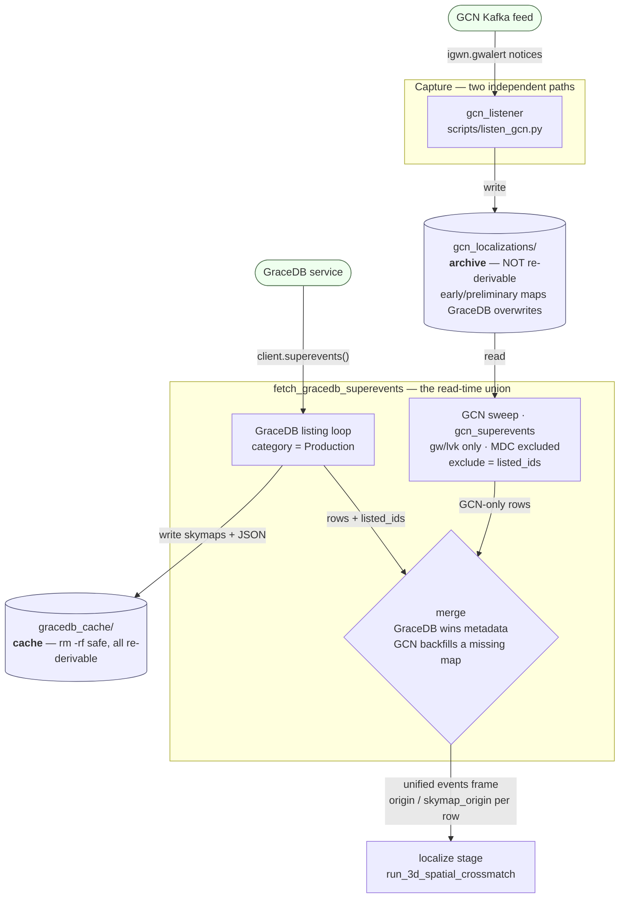

# Integrate the GCN store into the localize read path

## Data flow

Two independent capture paths write two on-disk stores. Today only the cache is read. This change
makes `fetch_gracedb_superevents` a read-time **union** of both, so `localize` sees the live GCN
archive alongside the GraceDB listing.



Reading it: the **Kafka → listener → `gcn_localizations/`** path runs continuously and is the only
copy of the maps GraceDB later replaces. The **GraceDB → listing → `gracedb_cache/`** path runs
inside the `localize` scan. Both meet only at read time, inside `fetch_gracedb_superevents`: the
listing drives the loop and records every id it saw (`listed_ids`); the GCN sweep contributes rows
for ids the listing did not return; and the merge lets a GCN map backfill a listing row that has
none. Every emitted row carries `origin` / `skymap_origin` so downstream knows which pipe each
value came down.

## RESOLVE THIS FIRST

Open items left at the end of the 2026-08-31 review session. **None of these have been applied to
the document below** — the text further down still says the old thing where they conflict. Work
through these before treating the rest of the plan as final.

### 1. `skymap_path` will not be absolute — real defect, blocking

The field table in §1 gives `skymap_path` as
`gcn_store.latest_skymap_path(GCN_CATEGORY, GCN_SOURCE, event_id, root)` and annotates it
"absolute". It is not. That function builds `Path(root) / category / source / event_id` and
returns `directory / target` with no `.resolve()` (`gcn_store.py:599-606`), so it is absolute only
when `root` already is — and it will not be. §4 sets `store_root = Path("gcn_localizations")`,
relative; §5 calls `cfg.gcn.to_store_root()` with no argument.

This breaks a documented contract. `fetch_gracedb_superevents`' docstring (`gracedb_tools.py:448-452`):
"The path is absolute so that `run_3d_spatial_crossmatch` and `skymap_plots` can open it directly:
neither is given the cache, so neither has a root to resolve a relative path against." GraceDB rows
honour it via `cache.resolve()`, which ends in an explicit `.resolve()` (`gracedb_cache.py:241`).
The GCN path has no equivalent.

It is the insidious kind of bug: inside one run it works, because `run_3d_spatial_crossmatch`
checks `Path(skymap_path).exists()` at `:1009` in the same process with the same working
directory. The failure is in the **persisted** frame — a relative path written to parquet is
meaningless to any later reader whose cwd differs (a notebook, the slack stage, a re-analysis).
Green in dev, wrong in a scheduled run started from elsewhere. Same class as the `instruments`
bug: invisible until something downstream consumes the output.

**Fix:** call `.resolve()` before the value enters a row, owned by `gcn_skymap_for` since both the
sweep and the merge go through it and both put the result in a frame. Move the "absolute"
annotation off `latest_skymap_path` — that function is fine, it just never promised this.

### 2. MDC signal is a best guess, not a confirmed rule — not blocking

§"Scope: MDC alerts are excluded" now specifies: exclude when **either** `event.search == "MDC"`
or the superevent id starts with `M`. That is a deliberate belt-and-braces guess chosen for its
failure mode, not a verified convention — the only payload we have carries both signals at once,
so neither is shown sufficient alone. Log which rule fired so the captured archive can answer it.
Tracked as **follow-up issue 5**; likely end state is an id allowlist (`startswith("S")`) once the
prefix convention is confirmed.

### 3. Small corrections to §1, not yet applied — not blocking

- **`gcn_skymaps` is missing from the "Reuses" line.** The module now imports it for the
  `SKYMAP_SOURCE_*` constants. Worth a clause on why the direction is fine: `gcn_skymaps` and
  `gracedb_tools` both already carry the `ligo.skymap` chain, and it is `gcn_store` that is
  deliberately kept off it (`gcn_store.py:31-33`).
- **`gcn_examples.py:104-140` is a stale line range** — the `igwn_gwalert` function runs roughly
  83-146.
- **`search` now does double duty** — it is both a row column and an MDC signal. The field table's
  `pipeline, search ← payload["event"]` row should cross-reference the scope section.
- **Optional simplification:** `latest_skymap_path` re-reads `latest.json` from disk even though
  `gcn_superevent_row` already holds the pointer; `event_dir / pointer["latest_skymap"]` is the
  same answer without the second read. Weigh against the value of one shared function.

### 4. The document has not had a full coherence pass

§1 and §2 roughly doubled in length across nine sequential edits and were never read end to end.
Specifically unverified: whether the new "Scope: MDC" section sits well beside the original
"Scope: gw/lvk" one, and whether §1 still flows after the insertions. Sections 3-6 and
Verification were edited but only partially re-read.

### Settled, no action needed

- The ~25 existing `test_gracedb_tools.py` calls pass `gcn_store_root=None`, not the fixture.
  Confirmed; §2 already says this.
- `skymap_file` takes the notice's own `skymap_filename` from the notice that supplied the stored
  map (option "c"). Confirmed; §1 already says this.
- `cache_status` is `None` for GCN rows, with `origin` carrying the information.
- `event.significant` is not cut on; open question tracked as follow-up issue 4.

---

## Context

`desi-alert-augmentation-pipeline` grew two independent on-disk stores that never meet:

- **`gracedb_cache`** (PR #31) — `superevents/<sid>.json` plus `skymaps/`, keyed by superevent id,
  written only by `fetch_gracedb_superevents`, read only by the `localize` stage.
- **`gcn_localizations`** (PR #23) — `<category>/<source>/<event_id>/` with `history.jsonl`,
  `latest.json` and MOC FITS maps, written only by `gcn_listener`. Nothing outside
  `scripts/listen_gcn.py` and its tests imports it.

So the live GCN Kafka feed archives LVK alerts that the pipeline never sees. What that costs,
precisely:

- **The early-warning and preliminary maps GraceDB later replaces.** Not recoverable from
  GraceDB at all — the archive is the only copy. This is the main win.
- **Superevents the live listing does not return** but the Kafka feed did deliver.

It is worth being clear about what this does *not* buy, since the obvious framing is wrong: the
sweep runs inside a scheduled scan and behind the same `client.superevents()` call, so no alert
is seen sooner than it would have been, and if the listing query raises, the GCN rows are lost
with it. The gain is coverage and map provenance, not latency.

The intended outcome: `localize` consumes both sources through one call, each row says where its
data and its skymap came from, and neither store changes shape.

### The design decision, and why not the obvious one

The first instinct was to *promote* GCN data into `gracedb_cache` — write entries, copy skymaps.
Rejected, for three reasons:

1. **It breaks the cache's invariant.** The README states "To start over, delete the directory:
   all of it is re-derivable." A GCN-carried preliminary map is *not* re-derivable — GraceDB has
   since replaced it. Promotion would make `rm -rf gracedb_cache` destroy unrecoverable data.
   A cache and an archive have different safety levels; mixing them demotes the archive.
2. **It saves no work on the read path.** `fetch_gracedb_superevents` has to learn about a second
   source either way, because the *live listing* drives its loop — a cache entry the listing does
   not name is never read. Given it must read something extra, it can read the GCN store directly.
3. **Downstream does not need the copy.** `run_3d_spatial_crossmatch` calls
   `read_sky_map(skymap_path)` on an absolute path (`gracedb_tools.py:1003-1014`). That path can
   point into `gcn_localizations/` as easily as into `gracedb_cache/skymaps/`.

Three problems disappear with the copy: retractions are already handled by
`latest_skymap_entry` (`gcn_store.py:378-381`, returns `None` once the newest notice is a
retraction); GCN entries have no `files` list and an incomplete `fingerprint`, so promoted
entries would sit permanently `stale_fingerprint`; and no backfill script or listener hook is
needed. The dependency arrow also points the right way — `gracedb_tools` already carries the
`ligo.skymap` chain, whereas a listener hook would have dragged `gracedb_cache` into
`gcn_listener`, against the note at `gcn_store.py:31-33`.

### Scope: `gw/lvk` only

Filter on `category == "gw" and source == "lvk"`, an allowlist rather than an exclusion. This is
not merely tidiness: `parse_icecube_lvk_nu_track_search` (`gcn_notices.py:550,561`) keys that
topic on `ref_ID`, so a **neutrino** notice is filed under a superevent id
(`neutrino/icecube_lvk_nu_track_search/S230914ak/`). Selecting on "the event id looks like a
superevent" would pull a neutrino error circle in as a superevent.

GRB, neutrino and optical notices are deferred to follow-up issues (`planning/followup_issues.md`).
They need a key space that is not `superevent_id`, and their maps are *synthesized* from an error
ellipse, so they carry no `DISTMU` and are skipped at `gracedb_tools.py:1020` — consuming them
needs a 2D credible-region path that does not exist yet.

### Scope: MDC alerts are excluded, with no option to include them

`fetch_gracedb_superevents` already queries GraceDB with `category = "Production"`
(`gracedb_tools.py:478`, baked into the query at `:489`), hardcoded and unparameterized. The
pipeline has therefore always excluded MDC superevents from its primary source. Excluding them
from the GCN path is not a new policy — it is making the second source obey the one the first
already enforces.

Without it, the same MDC superevent is dropped when it arrives via GraceDB and admitted when it
arrives via Kafka, so whether a mock event enters the science frame depends on which pipe it came
down. If MDC data is ever wanted, that is one decision to make at `category`, for both sources.

**Which signal — the working answer.** Exclude when **either** fires: `event.search == "MDC"`, or
the superevent id begins with `M`. A blocklist on both axes rather than an allowlist on one,
chosen for its failure mode: over-excluding a real event is visible in the logged count and
recoverable, while under-excluding puts mock data silently into science results. Both signals are
present together in the one payload we have (`gcn_examples.py:39,118` — `MS181101ab`, `"MDC"`),
so neither is confirmed sufficient alone.

Log the count **and which rule fired**, so a few weeks of captured notices answer the question
empirically rather than from the spec. Tightening to an id allowlist (`id.startswith("S")`) is the
likely end state but needs the convention confirmed first — see follow-up issue 5.

**Comment wording.** Do not assert in a comment what MDC *is*, or that `M` marks it — both are
unsourced claims about an external convention. Anchor to what the code demonstrably does:

```python
# Excluded to match the "category: Production" filter the GraceDB listing query already
# applies, so the same superevent is not dropped from one source and admitted from the other.
# Two signals, either sufficient, until issue #5 confirms which is authoritative.
```

`event.significant` is **not** cut on. The FAR cut is expected to subsume it
(`far_threshold_per_year = 2.0`, and low-significance alerts are published at far higher FAR),
and `test_no_scientific_cut_carries_a_default` (`test_gracedb_tools.py:1507`) pins the convention
that this module states no scientific cut of its own — so a `require_significant=True` default
would be a second definition with nothing keeping it in step with `[localize]`. Whether an alert
can pass a 2/yr FAR cut while still being flagged `significant: false` is unconfirmed; see
follow-up issue 4.

---

## Changes

### 1. New module: `src/desi_aap/gcn_superevents.py`

The projection from GCN notices to superevent-shaped rows. A separate module rather than more
lines in `gracedb_tools.py` (already ~1500) and rather than in `gcn_store.py`, which stays free of
GraceDB concepts.

Reuses `gcn_store.event_directories`, `gcn_store.latest_skymap_path`, `gcn_store.notice_path`
(new, below), and `gracedb_tools.JULIAN_YEAR_SECONDS` / `as_float`.

```python
# Only igwn.gwalert notices are projected: they are the ones already keyed by superevent id.
# An allowlist rather than an exclusion, because parse_icecube_lvk_nu_track_search keys that
# topic on ref_ID, so a neutrino notice is also filed under a superevent id.
# TODO: support the other categories here. They are skipped only because the cache is
# superevent-keyed and their maps are synthesized, hence carry no DISTMU -- not because
# they are uninteresting.
GCN_CATEGORY = "gw"
GCN_SOURCE = "lvk"

# latest.json's map source -> the skymap_origin reported on a row. Keyed off the constants
# rather than their values: a rename in gcn_skymaps must not become a silent KeyError here.
SKYMAP_ORIGIN_BY_SOURCE = {
    gcn_skymaps.SKYMAP_SOURCE_INLINE: "gcn_notice_file",
    gcn_skymaps.SKYMAP_SOURCE_URL: "gcn_notice_url",
    gcn_skymaps.SKYMAP_SOURCE_SYNTHESIZED: "gcn_synthesized",
}

def iter_gw_pointers(root):
    """Yield (event_dir, latest.json) for every gw/lvk event in the store."""

def load_notice_payload(event_dir, stem):
    """Read one verbatim notice payload, at gcn_store.notice_path(event_dir, stem)."""

def gcn_superevent_row(event_dir, pointer, root):
    """Build one fetch_gracedb_superevents-shaped row from an event's pointer."""

def gcn_superevent_rows(root, *, se_types, far_threshold_per_year,
                        min_classification_prob_sum, exclude=frozenset()):
    """Rows for gw/lvk events passing the same cuts, excluding ids already listed."""

def gcn_skymap_for(event_id, root):
    """(skymap_path, skymap_origin) for one event, applying no cuts. For the merge."""
```

**Why `gcn_skymap_for` is separate from the sweep**, rather than the merge reusing the sweep's
output: the merge must apply *no cuts*. Consider S123 — GraceDB lists it, its authoritative
`p_astro.json` clears the 0.9 cut, but the skymap download failed; the GCN store holds an early
preliminary whose *inline* classification was 0.6. Gating the map on the notice's own cuts would
drop it, leaving S123 with `missing_skymap` and failing every SN near it spatially, even though
GraceDB had already ruled the event in. Cuts decide whether to admit an event; they do not decide
whether to trust a map.

**Cuts, spelled out** rather than "the same cuts", so the two implementations cannot drift:
FAR drops on `>= far_threshold_per_year` *and* on non-finite (`gracedb_tools.py:503`); the
classification cut is strictly `>` (`:580`); keys are `[t.upper() for t in se_types]` (`:491`),
which match the notice's `BNS`/`NSBH`/`BBH`/`Terrestrial` inline classification; a class the
payload omits reads `0.0`, not NaN (`:482-486`).

**Every event is projected inside a try/except.** `fetch_gracedb_superevents` promises that
"Per-superevent failures are not fatal … the scan continues" (`gracedb_tools.py:383-384`), and
the sweep must keep that promise. One truncated `notices/*.json`, one unparseable `latest.json`,
or one event directory holding `history.jsonl` but no pointer — reachable if a process dies
between the append and `update_latest_pointer` (`gcn_store.py:517-519`) — must not take down a
scan that has already collected every GraceDB row. A failure yields a row with
`status = "gcn_read_failed: ..."`, matching how a `file_list_failed` superevent is kept rather
than dropped.

Field mapping — every value below is present in the `igwn_gwalert` fixture at
`tests/desi_aap/gcn_examples.py:104-140`:

| Row column | Source |
|---|---|
| `superevent_id` | `pointer["event_id"]` |
| `gw_time` | `pd.Timestamp(payload["event"]["time"])` |
| `gps_time` | `Time(gw_time).gps`, so the column stays meaningful downstream |
| `far_hz`, `far_per_year` | `payload["event"]["far"]`, × `JULIAN_YEAR_SECONDS` — same units as the listing's `far` |
| `p_bns`, `p_nsbh`, `p_bbh`, `p_terrestrial` | `payload["event"]["classification"]` — same class keys as `p_astro.json` |
| `classification_file` | `None` — the notice carries the classification inline |
| `pipeline`, `search` | `payload["event"]` |
| `instruments` | `",".join(payload["event"]["instruments"])` — **see below** |
| `preferred_event`, `labels` | `None` / `""` — a notice carries neither |
| `skymap_file` | `skymap_filename` from the notice that supplied the stored map — **see below** |
| `skymap_path` | `gcn_store.latest_skymap_path(GCN_CATEGORY, GCN_SOURCE, event_id, root)`, absolute |
| `status` | `"ok"`, or `"gcn_read_failed: ..."` |
| `cache_status` | `None` — a GCN row never touched the cache |
| `origin` | `"gcn"` |
| `skymap_origin` | `SKYMAP_ORIGIN_BY_SOURCE.get(pointer["latest_skymap_source"])` |

**`instruments` must be joined into a string.** The listing carries
`preferred.get("instruments")`, which is comma-joined text (`"H1,L1"`, see `conftest.py:135`);
the IGWN notice carries a list (`["H1","L1","V1"]`, `gcn_examples.py:117`). Left as a list, the
column holds both types, and the run dies at the very end — `gw_instruments` survives
`temporal_crossmatch_sesn_to_gw` and `select_coincidences` unchanged into the parquet write,
where pyarrow raises `ArrowTypeError: Expected bytes, got a 'list' object`. Verified.

**`skymap_origin` uses `.get`, not a subscript.** `update_latest_pointer` writes
`latest_skymap_source: None` for an event with no map (`gcn_store.py:416`), and a subscript on
`None` is a KeyError. It also has to survive an unrecognized source: the store's own test helper
`fake_resolve` returns `"test"` (`test_gcn_store.py:47`), so any store built with it would
otherwise blow up in the new tests before production ever saw it.

**`skymap_file` comes from the notice that supplied the map**, not from the newest notice.
`latest_skymap_entry` deliberately returns the newest notice *carrying a map*, which an update
can supersede without repeating (`gcn_store.py:359-381`) — so reading `skymap_filename` off the
newest notice would name a file `skymap_path` does not point at. The map's notice is reachable
without touching `history.jsonl`: `latest.json` carries `latest_skymap_stem`, and every notice is
stored at `notices/{stem}.json`.

This keeps `None` in that column meaning exactly one thing — *no map was named* — on both sides.
It is already taken: a GraceDB superevent whose listing has no skymap gets `skymap_file = None`
(`test_gracedb_tools.py:775`). Blanking the column for every GCN row would give it a second
meaning, and a sentinel would put a non-filename into a column of filenames while duplicating
what `skymap_origin` already says.

Two details: read it with `.get`, since a notice carrying a map need not name one and `None` is
then the right answer; and when the stored map is the joint external-coincidence map
(`label == "combined"`, which `skymaps[0]` can be if the event map was absent), the name is
`external_coinc.combined_skymap_filename`.

**Retractions** need no field of their own: skip the event when `pointer["is_retraction"]` is
true. A retracted superevent should not be localized at all, and `latest_skymap_path` already
returns `None` for one. The flag is reliable on the pointer: IGWN carries no `record_number`
(`gcn_notices.py:487`), so `entry_sort_key` falls through to `alert_type_rank`, where retraction
ranks highest at 5 (`:66-73`).

An event whose notice carried no map keeps its row with `skymap_path = None`, matching how a
listing row survives a failed skymap download.

**Why a second read per event.** `latest.json` holds one history entry plus three derived
`latest_skymap_*` fields, and that entry is only `NoticeRecord.summary()` — no `far`, no
`classification`, no `significant` (`gcn_notices.py:325-346`), because that shape is shared by
all six notice families. Those live in the payload, written verbatim to `notices/<stem>.json`.
Hence `load_notice_payload`, called twice: once for the latest notice (metadata, cuts) and once
for the map's notice (`skymap_file`), which are usually the same file.

**New in `gcn_store`:** `notice_path(directory, stem) -> directory / NOTICE_SUBDIR / f"{stem}.json"`,
used by both `store_notice` and this module, so the naming rule has exactly one definition
instead of being reconstructed by a reader that does not own it.

### 2. `src/desi_aap/gracedb_tools.py` — `fetch_gracedb_superevents`

- New **required** keyword-only `gcn_store_root`, with no default, mirroring `cache`. The
  reasoning at `gracedb_tools.py:404-407` and `gracedb_cache.py:182-187` — "the location is always
  an explicit decision" — applies unchanged, and a silent default here would mean a caller who
  forgets the argument quietly loses the whole GCN feed. Opting out is `gcn_store_root=None`,
  spelled out. A `None` root, or a directory that does not exist, means no GCN rows:
  `gcn_store.event_directories` already returns `[]` for a missing root, so degradation is free.

  **Call sites.** Production and docs: `stages/localize.py:505`, the README snippet at line 299,
  `docs/pre_executed/benchmark_loc_map_xmatch.ipynb` / `gracedb_sesn_refactor.ipynb`. Tests:
  **~25 calls in `tests/desi_aap/test_gracedb_tools.py`**, which is the bulk of the change and
  needs its own decision rather than a mechanical find-and-replace.

  Two new `conftest.py` fixtures carry it, mirroring `superevent_cache` (`conftest.py:31-39`) and
  its reasoning — rooted under `tmp_path` so no test depends on the working directory:

  ```python
  @pytest.fixture
  def gcn_store_root(tmp_path):
      """An empty GCN store root under tmp_path, so no test reads the working directory's."""
      return tmp_path / "gcn_localizations"

  @pytest.fixture
  def gcn_store(gcn_store_root):
      """Build a GCN store from notice payloads, so a test states its notices, not the layout."""
      # store(*payloads, topic=TOPIC_IGWN_GWALERT) -> gcn_store_root
  ```

  Which call gets which:

  - **The ~25 existing tests pass `gcn_store_root=None`**, not the fixture. They are about
    GraceDB behaviour; handing them a real store root — even an empty one — puts them on a code
    path they do not mean to exercise, and it would silently become load-bearing the first time
    someone gave one of them a populated store. Spelling out `None` is also the "opting out is
    explicit" contract being used 25 times rather than merely asserted once.
  - **The new merge tests take `gcn_store`**, which is the only place a populated store belongs.
  - **One test takes bare `gcn_store_root`** — an empty directory that exists — so the `[]`
    degradation path is pinned separately from the `None` path. They are different branches and
    only one of them is covered by the 25.

  The fixture pair is written in this PR rather than deferred: verification step 1 needs a store
  builder either way, and both new test files need it, which is the "visible to the whole suite"
  criterion `superevent_cache`'s own docstring names.
- Every listing row gains `origin: "gracedb"` and `skymap_origin: "gracedb"` (or `None` when the
  row has no map). **Including the `file_list_failed` stub row**, which is built as its own dict
  (`gracedb_tools.py:519-531`) — omit it there and pandas fills NaN for those rows only.
- **Collect `listed_ids`** — every `sid` the listing returns, recorded at the top of the loop
  immediately after `sid = superevent.get("superevent_id")`, *before* any cut. This is not the same
  as the ids in `rows`: the FAR cut (`line 503`) and the p_astro cut (`line 580`) both `continue`
  without appending a row. Excluding on `rows` alone would let the sweep resurrect a superevent
  GraceDB has ruled out, judging it on the notice's inline classification instead of the
  authoritative `p_astro.json`. If the listing *ruled on* it, GraceDB has spoken.
- After the listing loop, sweep the GCN store with `exclude=listed_ids` and extend `rows`. The
  exclusion is load-bearing against a crash, not merely against a duplicate row:
  `run_3d_spatial_crossmatch` does `gw_events.set_index("superevent_id", drop=False)` then
  `.loc[superevent_id]` (`:994,1001`), which returns a *DataFrame* on a duplicated index and makes
  the `pd.isna(skymap_path)` guard at `:1009` raise on an array. GCN-only superevents are exactly
  what the sweep is for.
- **Merge rule for a superevent in both** — GraceDB wins on metadata, GCN fills only a missing
  map. Applied to the listing row after the loop, through `gcn_skymap_for`, which applies no cuts
  (see §1):
  - GraceDB has a `skymap_path` → unchanged, `origin` stays `"gracedb"`.
  - GraceDB has none and the GCN store does → adopt the GCN `skymap_path` and its
    `skymap_origin`; set `origin = "gracedb+gcn"`.
  - Read the current value as `row.get("skymap_path")`: the stub row has no such key at all.
- **`file_list_failed` is a backfill, not an exclusion.** "GraceDB has spoken" holds for the two
  *cuts*. It does not hold for the file-listing failure, where GraceDB said nothing and the network
  did. That row carries `gw_time = pd.NaT`, so `temporal_crossmatch_sesn_to_gw` skips it outright
  (`:658-659`) and the GCN store — which may hold a complete, usable row for the same superevent —
  is excluded along with it. Instead, for a stub row whose id the GCN store has, take the notice's
  `gw_time`, `gps_time`, classification and skymap fields, and:
  - **keep `status` and `cache_status` unchanged**, so the failure stays visible in the frame
    rather than being papered over;
  - **keep the listing's `far_hz` / `far_per_year`**, which were set before the failure and remain
    authoritative;
  - set `origin = "gracedb+gcn"`.

  GraceDB is not overridden here — it produced nothing to override.
- Docstring: document `gcn_store_root`, the two new columns, that `cache_status` is `None` for a
  GCN-sourced row, and that the frame is now the union of the listing and the GCN store rather
  than the listing alone.

### 3. `temporal_crossmatch_sesn_to_gw` (`gracedb_tools.py:713-726`)

Add `"origin"` and `"skymap_origin"` to the copied column list, giving `gw_origin` and
`gw_skymap_origin`. The `gw_` prefix is on the *column name*, not the value — `gw_origin` holds
`"gcn"`, not `"gw_gcn"`. That function's output merges a transient catalog with the event table,
so each of the event fields it copies is prefixed to avoid colliding with a catalog column of the
same name — twelve today, fourteen after this change. `origin` and `status` are exactly the kind
of name that could collide; no catalog carries an `origin` column today, so this is the convention
holding rather than a collision being fixed.

Worth doing because `gw_skymap_path` is already in that list, and without `gw_skymap_origin` a
reader cannot tell whether that path is a real LVK map or a synthesized ellipse. On the live path:
`stages/localize.py:354`. Update the docstring's `gw_*` list at `gracedb_tools.py:681-684`.

### 4. `src/desi_aap/config.py` — new `[gcn]` section

Mirror `GraceDbConfig` exactly, including the relative-path-against-a-root behaviour:

```python
class GcnConfig(_Section):
    """The ``[gcn]`` section: where the GCN notice store lives."""
    store_root: Path = Path("gcn_localizations")   # matches gcn_store.STORE_ROOT

    def to_store_root(self, root: Path | None = None) -> Path: ...
```

Add `gcn: GcnConfig = GcnConfig()` to `PipelineConfig` (`config.py:216-228`), and a commented
`[gcn]` block to `config.toml` next to `[gracedb]`, carrying the same working-directory warning.

### 5. `src/desi_aap/stages/localize.py:505-510`

```python
events = fetch_gracedb_superevents(
    settings.se_types,
    cache=cfg.gracedb.to_cache(),
    gcn_store_root=cfg.gcn.to_store_root(),
    ...
)
```

Add `n_superevents_gcn_only` and `n_superevents_gcn_backfilled` to `summary`, counted from
`origin` (`"gcn"` and `"gracedb+gcn"`), so a run's log says how much came from the live feed and
how much of the listing the feed rescued.

**Guard the empty frame.** `fetch_gracedb_superevents` returns a bare `pd.DataFrame()` with no
columns when nothing passes (`gracedb_tools.py:640-641`). Today `localize.py:511` only calls
`len(events)`, which is safe; any column lookup is not.

### 6. Docs

`README.md`, the `## GraceDB` section (lines 288-360): a short subsection on the union — that
`gcn_localizations` is an archive rather than a cache and is *not* re-derivable, that GraceDB wins
where both have data, and what `origin` / `skymap_origin` mean.

Also, next to the existing `--domain` note: **a store captured from `test.gcn.nasa.gov` is
indistinguishable from a production one once written.** `store_notice` records the topic but not
the domain (`gcn_listener.py:198`), and the domain is documented as "the safe place to point a new
consumer group" (`gcn_listener.py:33-34`). Use a separate `--store-root` when rehearsing —
`listen_gcn.py` already has the flag, so this is a documentation fix, not a code change.

---

## Conventions to hold to

- Numpydoc docstrings throughout, matching the density of `gracedb_cache.py` — every module,
  function and non-obvious constant carries its reasoning.
- Per `CLAUDE.md`/memory: do not assert unsourced facts about the GCN wire format in comments.
  Anchor each claim to the fixture in `tests/desi_aap/gcn_examples.py` or to the parser in
  `gcn_notices.py` that demonstrably reads the field.
- Any bug found while testing: fix the source, document it in the docstring, leave a plain
  `#TODO: <the specific thing to confirm>` — never pin it in a test. TODOs are not addressed to a
  person; whoever picks the work up owns it.

---

## Verification

0. **Fixture work first**, since everything below depends on it.
   - `gcn_store_root` and `gcn_store` in `conftest.py`, as in §2.
   - `gcn_examples.igwn_gwalert()` gains `superevent_id=` and `search=` **overrides**, defaulting
     to today's `MS181101ab` / `"MDC"`. The defaults stay faithful to the published schema example
     — that is the fixture module's stated purpose — but with MDC excluded unconditionally, the
     current fixture yields **no row**, so every test below needs a non-mock variant
     (`superevent_id="S250101a", search="AllSky"`). This is not optional polish: without it there
     is no passing happy-path test at all.
   - The store builder leaves `store_notice`'s `resolve` at its **default**, not the
     `fake_resolve` that `test_gcn_store.py:24` uses. Two reasons: `build_moc_fits_bytes` writes
     genuinely valid MOC FITS, so the same fixture supports an end-to-end test through
     `run_3d_spatial_crossmatch` rather than only row-shape assertions; and `fake_resolve` returns
     source `"test"` (`:47`), which is not one of the `SKYMAP_SOURCE_*` values and would exercise
     the unknown-source path in every test rather than in the one that means to.
1. **New unit tests**, `tests/desi_aap/test_gcn_superevents.py`, over the `gcn_store` fixture:
   - a `PRELIMINARY` with an inline map yields a row with `origin == "gcn"`,
     `skymap_origin == "gcn_notice_file"`, an existing `skymap_path`, and `cache_status is None`;
   - `skymap_file` names the notice's `skymap_filename`, and after an `UPDATE` that carries no map
     it still names the **preliminary's** file — the map and the metadata come from different
     notices, and the column must follow the map;
   - `with_skymap=False` yields a row with `skymap_path is None` **and** `skymap_file is None`;
   - `instruments` is a comma-joined string, not a list — the regression guarding the parquet
     write. Assert the whole frame round-trips through `to_parquet`;
   - a `RETRACTION` after a preliminary yields **no** row;
   - the FAR and p_astro cuts drop a notice whose own values fail them;
   - an MDC notice in the store is never picked up, even with a passing FAR and classification —
     the regression guarding the `category: Production` parity;
   - a `neutrino/icecube_lvk_nu_track_search/S230914ak/` event in the same store is never picked
     up — the regression guarding the key collision. Carries a
     `#TODO: support icecube_lvk_nu_track_search here; it is skipped only because the cache is
     superevent-keyed and its maps are synthesized` so the exclusion reads as deferred work
     rather than a decision that these events do not matter;
   - a store holding an event directory with `history.jsonl` but no `latest.json` yields
     `status = "gcn_read_failed: ..."` for that event and **rows for every other event** — the
     regression guarding the containment promise;
   - a missing root, and separately an existing-but-empty root, each yield `[]`.
2. **Merge tests** in `tests/desi_aap/test_gracedb_tools.py`, alongside the existing cache
   integration tests (~1355-1505), using `superevent_cache`, `gcn_store` and a mocked client:
   - a superevent in the listing with a skymap keeps it, `origin == "gracedb"`;
   - one in the listing whose skymap download failed adopts the GCN map,
     `origin == "gracedb+gcn"`, **even when the notice's inline classification would fail the
     cut** — the regression guarding the no-cuts rule on `gcn_skymap_for` (the S123 case in §1);
   - one only in the GCN store appears with `origin == "gcn"` and `cache_status is None`;
   - **a superevent the listing named but that failed the FAR or p_astro cut does not reappear**
     via the sweep, even when the GCN store holds it with a passing inline classification — the
     regression guarding the `listed_ids` fix;
   - a superevent whose **file listing failed** is backfilled from the GCN store: it gains a
     `gw_time` and a classification, keeps `status` starting `"file_list_failed:"`, keeps the
     listing's `far_per_year`, and reports `origin == "gracedb+gcn"`;
   - `gcn_store_root=None` reproduces today's frame exactly, columns aside.
2b. **Stage wiring**, in `test_localize.py`: assert `localize` passes the configured root, via
   `stub.fetches[-1][1]["gcn_store_root"]`. `conftest.py:172`'s `fake_fetch(se_types, **kwargs)`
   swallows the new argument, so nothing else would catch the stage passing the wrong value — or
   none at all. The stub already records kwargs for exactly this purpose.
3. `pytest tests/desi_aap/ -q` — the full suite, confirming the golden-alert and localize stage
   tests are unmoved.
4. **End to end against real data.** The repo already has a populated `gracedb_cache/` (349
   entries, 15 skymaps) but no `gcn_localizations/`. Populate one with a short live capture:
   ```
   GCN_CLIENT_ID=... GCN_CLIENT_SECRET=... \
     python scripts/listen_gcn.py --topics igwn.gwalert --once --log-level INFO
   ```
   then run the stage and confirm the new columns and the two `origin` counts in the summary:
   ```
   desi-aap run --stage localize --dry-run
   ```
   `--dry-run` still queries GraceDB and writes the cache, so it exercises the full path without
   producing results.

   Two things to look at in that run specifically, since neither has a unit test that can prove
   them against real data: how many captured notices the MDC filter dropped (the logged count),
   and whether the frame writes to parquet — the `instruments` bug is invisible until it does.

---

## Follow-up issues

Moved to `planning/followup_issues.md`, drafted in full and ready to revise and post. Nothing
there gets filed automatically. In summary:

1. Consume GRB and optical GCN localizations in the localize stage.
2. Consume IceCube neutrino localizations — split from 1 because the LVK-nu topic is already
   superevent-keyed and so is join-shaped rather than row-shaped.
3. Join non-GW GCN notices to their superevents, via `find_events(related_id=...)`.
4. Confirm whether the FAR cut already subsumes `event.significant` — the open question left by
   the scope decision above.

Also recorded there: why renaming `gracedb_cache` to `superevent_cache` was considered and
dropped once the design became a read-time union.

---

## Planning docs are temporary

`planning/` holds this file, `followup_issues.md` and `pr-description.md`. All three are deleted
before the PR is opened, once `pr-description.md` has been copied into the PR body. The project
squash-merges (every recent commit is single-parent, titled `... (#NN)`), so intermediate commits
never reach `main` and a file added then deleted on this branch leaves no trace. The squash does
take the branch's **final tree**, though — so if the deletion is forgotten, these land on `main`
in full. Deleting them is the last step before opening the PR, welded to a step that cannot be
skipped: copying the description out of this directory.
